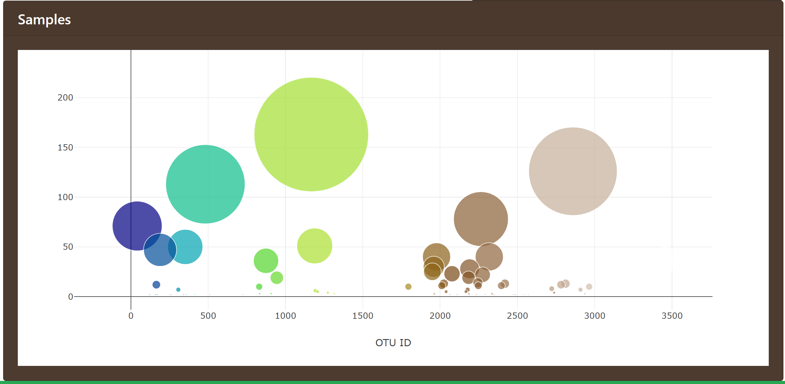

# Interactive Data Visualization with Plotly
## Belly Button Biodiversity

## live [demo](http://ec2-18-224-60-188.us-east-2.compute.amazonaws.com:5000/)

The coolest study of biodiversity on the human body on the planet!
The belly button is one of the habitats closest to us, and yet it remains relatively unexplored. In January 2011, [The Public Science Lab](http://robdunnlab.com/) launched Belly Button Biodiversity to investigate the microbes inhabiting our navels and the factors that might influence the microscopic life calling this protected, moist patch of skin home. In addition to inspiring scientific curiosity, Belly Button Biodiversity inspired conversations about the beneficial roles microbes play in our daily lives.

For this challenge, built an interactive dashboard using Plotly.js to explore the [Belly Button Biodiversity DataSet](http://robdunnlab.com/projects/belly-button-biodiversity/) and provide an in depth visulization of the type of microbes and its concentration in each sample.

* Created a PIE chart that uses data from top 10 samples to display microbe and percentage of each microbe found in the sample set.

  * Use `sample_values` as the values for the PIE chart.

  * Use `otu_ids` as the labels for the pie chart.

  * Use `otu_labels` as the hovertext for the chart.

  

* Created a Bubble Chart that uses data from samples to provide a detailed visulization of color coded microbes present in each sample and its concentration in each sample.

  * Use `otu_ids` for the x values.

  * Use `sample_values` for the y values.

  * Use `sample_values` for the marker size.

  * Use `otu_ids` for the marker colors.

  * Use `otu_labels` for the text values.

  

* Display the sample metadata 

  * Display each key/value pair from the metadata JSON object.

  

* All the plots are updated any time that a new sample is selected.

## Advanced Challenge 

* Adapt the Gauge Chart from <https://plot.ly/javascript/gauge-charts/> to plot the Weekly Washing Frequency of bellybutton which depends upon the the microbes and its percentage present in a given sample.

### Copyright

Indira V. Poovambur © 2019. 
